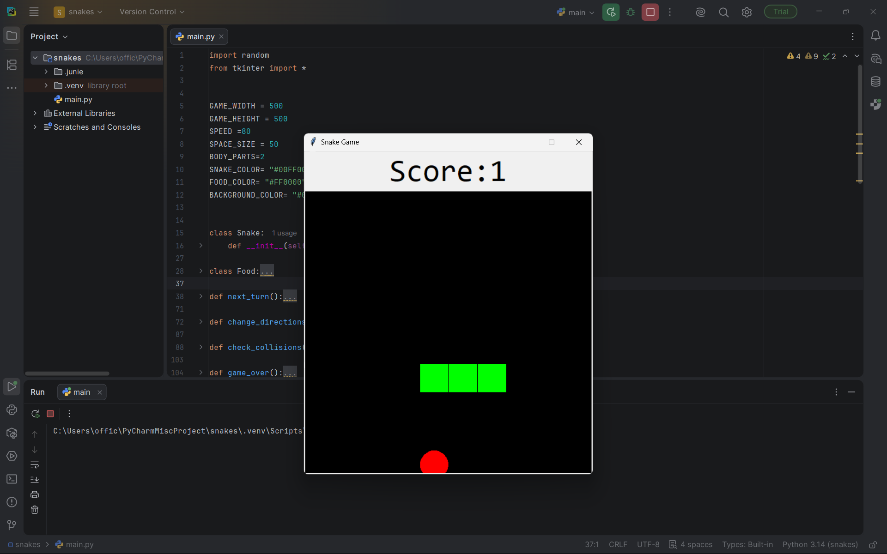

#  Snake Game 

A classic Snake Game built with Python using the Tkinter GUI library.

##  Gameplay
- Control the snake using arrow keys
- Eat the red food to grow longer and increase your score
- Avoid hitting the walls or yourself

##  Built With
- Python 3.14
- Tkinter (built-in GUI library)

##  How to Run
1. Clone the repository
   git clone https://github.com/K-Armaan2804/snake-game-python.git

2. Run the game
   python main.py

No external libraries required.

## Configuration

You can tweak these constants in `main.py`:

| Constant | Default | Description |
|----------|---------|-------------|
| `GAME_WIDTH` | 500 | Canvas width (px) |
| `GAME_HEIGHT` | 500 | Canvas height (px) |
| `SPEED` | 80 | Game speed (ms) |
| `SPACE_SIZE` | 50 | Grid cell size (px) |
| `BODY_PARTS` | 3 | Starting snake length |

## Preview

##  Author
**Armaan Kashyap**  
[GitHub](https://github.com/K-Armaan2804)
